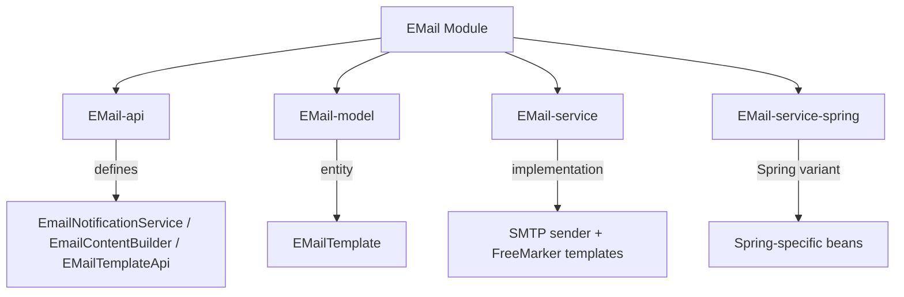

# EMail Module

## Module goal

The EMail module provides a comprehensive email management system for the Water Framework, supporting template-based email sending, SMTP integration, and email template management. It offers both programmatic and template-based email capabilities with support for attachments, multiple recipients (TO, CC, BCC), and customizable SMTP configurations. The module integrates with Jakarta Mail for reliable email delivery and uses FreeMarker for dynamic template processing.

## Architecture Overview



## Sub-modules

| Sub-module | Description |
|---|---|
| **EMail-api** | Defines `EmailNotificationService`, `EmailContentBuilder`, `EMailTemplateApi`, `EMailTemplateSystemApi` |
| **EMail-model** | Contains `EMailTemplate` JPA entity for template storage |
| **EMail-service** | SMTP email sending via Jakarta Mail, FreeMarker template processing, template management |
| **EMail-service-spring** | Spring-specific service registration |

## Module technical characteristics

- **Java and Jakarta Mail**: Core implementation using Java with Jakarta Mail API for SMTP communication
- **Template Engine**: FreeMarker integration for dynamic email template processing with parameter substitution
- **SMTP Configuration**: Flexible SMTP server configuration with authentication, TLS/SSL support, and customizable settings
- **Template Management**: CRUD operations for email templates with persistence and dynamic loading
- **Service Layer**: Implements `EmailContentBuilder` and `EmailNotificationService` interfaces for framework integration
- **Validation**: Comprehensive input validation using JSR-303 annotations and custom validation rules
- **Role-based Access Control**: Default roles for template management with granular permissions
- **Test Coverage**: Comprehensive JUnit tests with mocked SMTP for reliable testing
- **Gradle Build**: Multi-project build with publishing, code coverage, and SonarQube integration

## Permission and security

- **Role-based Permissions**: Three default roles for email template management:
  - `emailTemplateManager`: Full CRUD access to templates
  - `emailTemplateEditor`: Create, read, update (no delete)
  - `emailTemplateViewer`: Read-only access to templates
- **Annotations**: Uses `@AccessControl` and `@DefaultRoleAccess` for entity-level security
- **Validation**: Prevents malicious input with `@NoMalitiusCode`, `@NotNullOnPersist`, and standard JSR-303 annotations
- **SMTP Security**: Supports authentication, TLS/SSL encryption, and secure password handling
- **Template Security**: Template content validation and safe parameter substitution

## How to use it

### Import in your project

#### OSGi:
```gradle
implementation group: 'it.water.email', name: 'EMail-api', version: project.waterVersion
implementation group: 'it.water.email', name: 'EMail-model', version: project.waterVersion
implementation group: 'it.water.email', name: 'EMail-service', version: project.waterVersion
```

#### Spring:
```gradle
implementation group: 'it.water.email', name: 'EMail-service-spring', version: project.waterVersion
```

### Setup and configuration

1. **Configure SMTP properties** (see Properties section below)
2. **Use the email services** for sending emails:

```java
@Inject
private EmailNotificationService emailService;

// Send email with template
HashMap<String, Object> params = new HashMap<>();
params.put("userName", "John Doe");
params.put("activationLink", "https://example.com/activate");

List<String> recipients = Arrays.asList("user@example.com");
List<String> ccRecipients = Arrays.asList("admin@example.com");

emailService.sendMail(
    "welcome-template",           // template name
    params,                       // template parameters
    "noreply@myapp.com",         // from address
    recipients,                   // to recipients
    ccRecipients,                // cc recipients
    null,                        // bcc recipients
    "Welcome to Our Application", // subject
    null                         // attachments
);

// Send email with custom content
emailService.sendMail(
    "noreply@myapp.com",
    Arrays.asList("user@example.com"),
    null, null,
    "Custom Subject",
    "<h1>Hello World</h1><p>This is a custom email.</p>",
    null
);
```

3. **Create and manage email templates**:

```java
@Inject
private EMailTemplateSystemApi templateService;

// Save or update template
templateService.saveOrUpdateTemplate(
    "welcome-template",
    "<h1>Welcome ${userName}!</h1><p>Please click <a href='${activationLink}'>here</a> to activate your account.</p>"
);

// Create template entity
EMailTemplate template = new EMailTemplate(
    "notification-template",
    "Notification email template",
    "<h1>Notification</h1><p>${message}</p>"
);
templateService.save(template);
```

## Properties and configurations

| Property | Description | Default | Required |
|----------|-------------|---------|----------|
| `it.water.mail.sender.name` | System sender name for emails | `Water-Application` | No |
| `it.water.mail.smtp.host` | SMTP server hostname | `localhost` | No |
| `it.water.mail.smtp.port` | SMTP server port | `587` | No |
| `it.water.mail.smtp.username` | SMTP username | `-` | No |
| `it.water.mail.smtp.password` | SMTP password | `-` | No |
| `it.water.mail.smtp.auth.enabled` | Enable SMTP authentication | `false` | No |
| `it.water.mail.smtp.start-ttls.enabled` | Enable STARTTLS | `false` | No |
| `water.keystore.password` | Keystore password for JWT signing | - | Yes |
| `water.keystore.alias` | Certificate alias in keystore | `server-cert` | Yes |
| `water.keystore.file` | Path to keystore file | - | Yes |
| `water.private.key.password` | Private key password | - | Yes |

Example configuration:
```properties
# SMTP Configuration
it.water.mail.sender.name=My Application
it.water.mail.smtp.host=smtp.gmail.com
it.water.mail.smtp.port=587
it.water.mail.smtp.username=myapp@gmail.com
it.water.mail.smtp.password=your-app-password
it.water.mail.smtp.auth.enabled=true
it.water.mail.smtp.start-ttls.enabled=true

# Security Configuration
water.keystore.password=water.
water.keystore.alias=server-cert
water.keystore.file=src/test/resources/certs/server.keystore
water.private.key.password=water.
```

## How to customize behaviours for this module

- **Custom SMTP Configuration**: Implement your own `EMailOptions` interface to provide custom SMTP settings or integrate with external configuration systems
- **Custom Email Templates**: Extend the template system by adding custom template loaders or integrating with external template repositories
- **Custom Email Providers**: Override the email sending logic to integrate with cloud email services (SendGrid, AWS SES, etc.)
- **Custom Validation**: Add or override validation annotations on the `EMailTemplate` entity for custom business rules
- **Custom Template Processing**: Extend the FreeMarker configuration or add custom template processors
- **Custom Email Content**: Override the `createBodyFromTemplate` method to add custom content processing (e.g., image embedding, dynamic styling)
- **Custom Attachment Handling**: Extend the attachment processing to support different file types or cloud storage integration
- **Custom Email Tracking**: Add email delivery tracking and logging by extending the email sending process
- **Integration with External Systems**: Use the service interfaces to integrate with CRM systems, marketing platforms, or other email-dependent applications
- **Testing**: Use the provided test utilities and mocked SMTP for testing custom email logic

## Notes
- The module uses Jakarta Mail for reliable SMTP communication and supports all standard email features
- FreeMarker templates support complex parameter substitution and conditional logic
- Email templates are automatically reloaded when the service activates
- The module is designed for extensibility and can be adapted to various email service providers
- All email operations are transactional and include proper error handling

